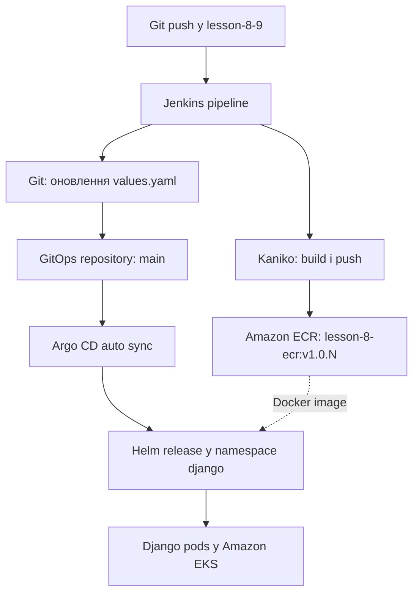
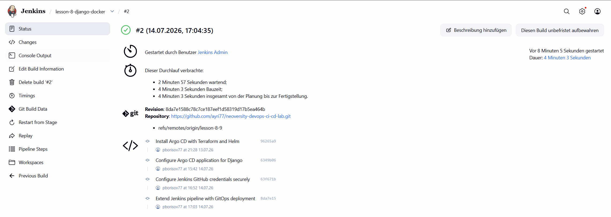
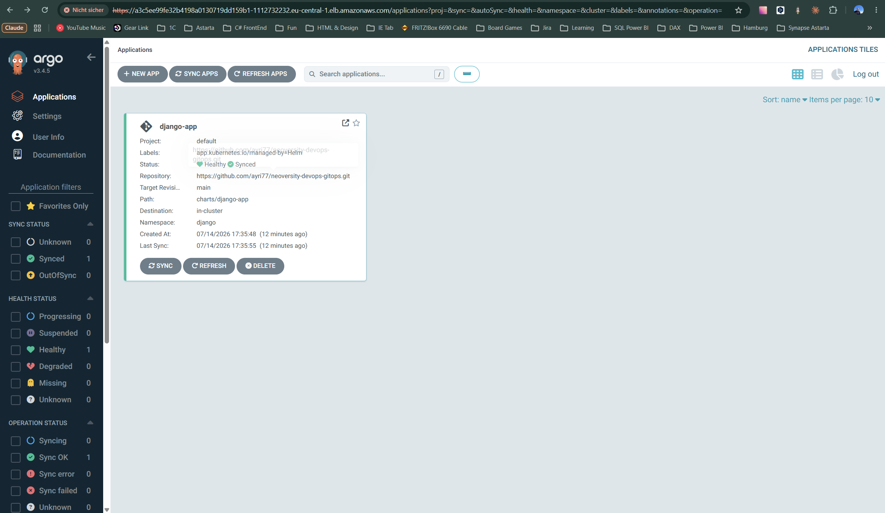
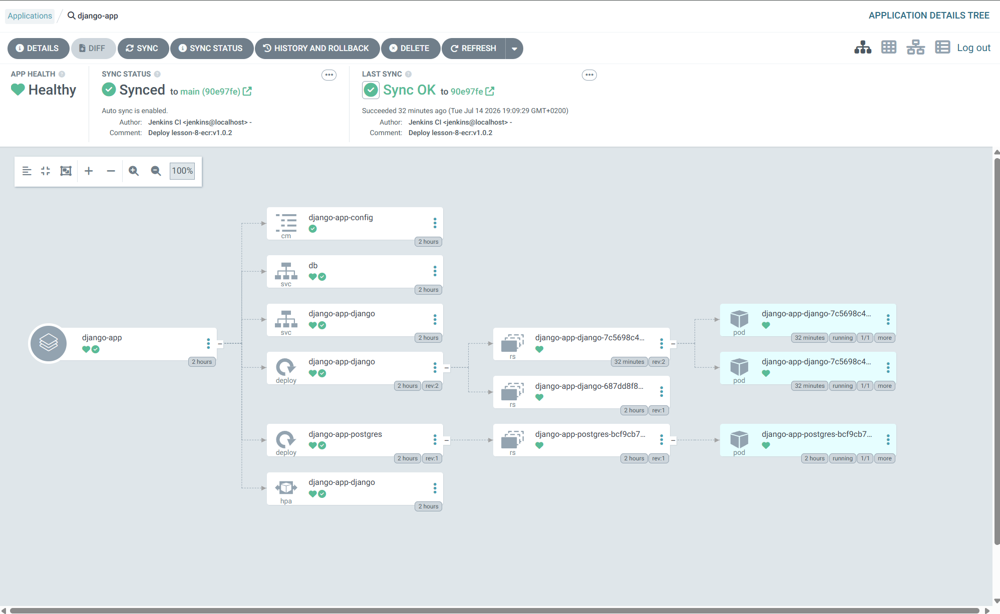

# Neoversity DevOps CI/CD — Jenkins CI + Argo CD

Практична робота за заняттями 8–9 реалізує повний CI/CD-процес для Django-застосунку з використанням Jenkins, Helm, Terraform, Amazon ECR, Amazon EKS та Argo CD.

Після запуску Jenkins pipeline:

1. Docker-образ Django-застосунку збирається за допомогою Kaniko;
2. образ публікується в Amazon ECR;
3. Jenkins оновлює тег образу в Helm chart окремого GitOps-репозиторію;
4. Argo CD виявляє Git commit та автоматично синхронізує застосунок у кластері EKS.

## Репозиторії

| Призначення | Репозиторій | Гілка |
|---|---|---|
| Код застосунку, Dockerfile, Jenkinsfile і Terraform | [neoversity-devops-ci-cd-lab](https://github.com/ayri77/neoversity-devops-ci-cd-lab/tree/lesson-8-9) | `lesson-8-9` |
| GitOps Helm chart із бажаним станом застосунку | [neoversity-devops-gitops](https://github.com/ayri77/neoversity-devops-gitops) | `main` |

Контрольні версії успішного розгортання:

- основний репозиторій: commit `8da7e15`;
- GitOps-репозиторій: commit [`90e97fe`](https://github.com/ayri77/neoversity-devops-gitops/commit/90e97fe) — `Deploy lesson-8-ecr:v1.0.2`;
- Docker image: `lesson-8-ecr:v1.0.2`;
- Argo CD Application: `django-app`, стани `Healthy` і `Synced`;
- у кластері працюють дві репліки Django-застосунку.

## Архітектура

| Компонент | Призначення |
|---|---|
| Terraform | Створює AWS-інфраструктуру та встановлює Jenkins і Argo CD через Helm |
| Amazon VPC | Надає мережу з публічними та приватними підмережами |
| Amazon EKS | Запускає Jenkins, Argo CD і Django-застосунок |
| Amazon ECR | Зберігає версійовані Docker-образи |
| Jenkins | Оркеструє CI pipeline |
| Kubernetes Jenkins Agent | Запускає тимчасовий pod із контейнерами Kaniko та Git |
| Kaniko | Збирає і публікує образ без Docker daemon |
| GitOps-репозиторій | Зберігає Helm chart і бажаний тег образу |
| Argo CD | Відстежує GitOps-репозиторій та синхронізує кластер |
| Helm | Описує встановлення Jenkins, Argo CD та Django-застосунку |

Кластер `lesson-8-eks` використовує дві worker nodes типу `t3.small`. Jenkins працює в namespace `jenkins`, Argo CD — у `argocd`, а Django-застосунок — у `django`.

## Схема CI/CD



CI та CD розділені:

- Jenkins відповідає за збірку, публікацію образу та зміну GitOps-репозиторію;
- Argo CD не запускається безпосередньо з Jenkins, а самостійно реагує на зміну бажаного стану в Git.

## Структура проєктів

Основний репозиторій:

```text
neoversity-devops-ci-cd-lab/
├── Jenkinsfile
├── docker/
│   └── django/
│       ├── Dockerfile
│       ├── manage.py
│       └── requirements.txt
├── terraform/
│   ├── backend.tf
│   ├── main.tf
│   ├── outputs.tf
│   ├── providers.tf
│   ├── storage.tf
│   └── modules/
│       ├── argo-cd/
│       ├── ecr/
│       ├── eks/
│       ├── jenkins/
│       ├── s3-backend/
│       └── vpc/
└── docs/
    └── images/
```

GitOps-репозиторій:

```text
neoversity-devops-gitops/
└── charts/
    └── django-app/
        ├── Chart.yaml
        ├── values.yaml
        └── templates/
            ├── configmap.yaml
            ├── deployment.yaml
            ├── hpa.yaml
            ├── ingress.yaml
            ├── postgres.yaml
            └── service.yaml
```

Каталог `django-chart/` в основному репозиторії залишено як результат попереднього заняття з Helm. Argo CD для цієї роботи використовує лише chart `charts/django-app` з окремого GitOps-репозиторію.

## Застосування Terraform

### Передумови

Потрібні такі інструменти:

- AWS CLI;
- Terraform;
- `kubectl`;
- Helm;
- Git.

AWS CLI використовує профіль `neoversity`, регіон — `eu-central-1`.

Перевірка доступу до AWS:

```bash
aws sts get-caller-identity --profile neoversity
```

Для remote state використовується S3 backend:

- bucket: `pbori-neoversity-terraform-state`;
- key: `lesson-8/terraform.tfstate`;
- блокування: S3 native lockfile через `use_lockfile = true`.

Backend був створений у попередній практичній роботі та має існувати до виконання `terraform init`. Він навмисно не створюється тим самим запуском Terraform, який уже використовує цей backend.

### Звичайний запуск для наявного backend та кластера

З кореня основного репозиторію:

```bash
terraform -chdir=terraform init -reconfigure
terraform -chdir=terraform fmt -check -recursive
terraform -chdir=terraform validate
terraform -chdir=terraform plan
terraform -chdir=terraform apply
```

Після створення EKS потрібно оновити локальний Kubernetes context:

```bash
aws eks update-kubeconfig \
  --region eu-central-1 \
  --name lesson-8-eks \
  --profile neoversity
```

Базова перевірка:

```bash
terraform -chdir=terraform output
kubectl get nodes
helm list --all-namespaces
```

### Перший запуск після повного видалення інфраструктури

Порядок запуску важливий:

1. окремо відновити S3 backend;
2. створити VPC, ECR та EKS;
3. створити Kubernetes Secret із GitHub PAT;
4. виконати повний `terraform apply`, який встановить Jenkins і Argo CD.

Спочатку створюється базова AWS-інфраструктура:

```bash
terraform -chdir=terraform init -reconfigure

terraform -chdir=terraform apply \
  -target=module.vpc \
  -target=module.ecr \
  -target=module.eks
```

Після оновлення kubeconfig створюється namespace і Secret. Токен вводиться приховано та не записується в команду shell history:

```bash
kubectl create namespace jenkins \
  --dry-run=client \
  -o yaml | kubectl apply -f -

read -rsp "GitHub PAT: " GITHUB_TOKEN
echo

kubectl create secret generic jenkins-github-token \
  --namespace jenkins \
  --from-literal=GITHUB_TOKEN="$GITHUB_TOKEN" \
  --dry-run=client \
  -o yaml | kubectl apply -f -

unset GITHUB_TOKEN
```

Після цього застосовується повна Terraform-конфігурація:

```bash
terraform -chdir=terraform plan
terraform -chdir=terraform apply
```

GitHub PAT створюється поза Terraform, тому його значення не потрапляє до Git або Terraform state.

## Перевірка Jenkins

Перевірити Jenkins controller, agent pods, сервіс і persistent volume:

```bash
kubectl get pods,svc,pvc -n jenkins
```

Отримати початковий пароль користувача `admin`:

```bash
kubectl get secret jenkins \
  --namespace jenkins \
  -o jsonpath='{.data.jenkins-admin-password}' \
  | base64 --decode
echo
```

Зовнішню адресу Jenkins показує сервіс типу `LoadBalancer`:

```bash
kubectl get svc jenkins -n jenkins
```

Jenkins конфігурується автоматично через JCasC. Після першого встановлення:

1. відкрити job `seed-job`;
2. натиснути **Build Now**;
3. переконатися, що створено pipeline job `lesson-8-django-docker`;
4. відкрити `lesson-8-django-docker` і натиснути **Build Now**;
5. у Console Output перевірити успішне виконання stages:
   - `Build & Push Docker Image`;
   - `Update GitOps Repository`.

Тег формується як `v1.0.${BUILD_NUMBER}`. Наприклад, build №2 створив образ `v1.0.2`.

Перевірити образ в Amazon ECR:

```bash
aws ecr describe-images \
  --repository-name lesson-8-ecr \
  --region eu-central-1 \
  --profile neoversity \
  --query 'sort_by(imageDetails,&imagePushedAt)[-1].[imageTags[0],imagePushedAt]' \
  --output table
```

Перевірити зміну GitOps-репозиторію:

```bash
cd ~/project/neoversity-devops-gitops
git pull --ff-only
git log -1 --oneline
grep -A3 '^image:' charts/django-app/values.yaml
```

Для контрольного запуску очікуються commit `90e97fe` і тег `v1.0.2`.

## Перевірка результату в Argo CD

Перевірити компоненти Argo CD та адресу вебінтерфейсу:

```bash
kubectl get pods -n argocd
kubectl get svc argocd-server -n argocd
```

Отримати початковий пароль користувача `admin`:

```bash
kubectl get secret argocd-initial-admin-secret \
  --namespace argocd \
  -o jsonpath='{.data.password}' \
  | base64 --decode
echo
```

У вебінтерфейсі потрібно відкрити Application `django-app` і перевірити:

- `Sync Status: Synced`;
- `Health Status: Healthy`;
- увімкнений `Auto-Sync`;
- revision відповідає GitOps commit `90e97fe`;
- Deployment має дві запущені Django replicas.

Ті самі стани можна перевірити через `kubectl`:

```bash
kubectl get application django-app -n argocd

kubectl get application django-app \
  --namespace argocd \
  -o jsonpath='{.status.sync.status}{" / "}{.status.health.status}{"\n"}'

kubectl get deployment,pods,svc -n django -o wide

kubectl get deployment django-app-django \
  --namespace django \
  -o jsonpath='{.spec.template.spec.containers[0].image}{"\n"}'
```

Очікуваний результат останньої команди:

```text
487337210313.dkr.ecr.eu-central-1.amazonaws.com/lesson-8-ecr:v1.0.2
```

## Ключові особливості реалізації

### Окремий GitOps-репозиторій

Код застосунку та CI-конфігурація зберігаються окремо від бажаного стану Kubernetes. Jenkins не змінює manifests у своєму репозиторії, а створює commit у `neoversity-devops-gitops`. Завдяки цьому історія розгортань є окремою, а Argo CD має одне чітке джерело бажаного стану.

### Kubernetes Agent із двома контейнерами

Jenkins створює тимчасовий agent pod із двома спеціалізованими контейнерами:

- `kaniko` збирає та публікує Docker-образ;
- `git` змінює `values.yaml`, створює commit і виконує push.

Kaniko не потребує Docker daemon або монтування `/var/run/docker.sock` у pod.

### IRSA замість постійних AWS-ключів

ServiceAccount `jenkins-sa` пов'язаний з IAM role через IAM Roles for Service Accounts. Kaniko отримує тимчасові AWS credentials для публікації в ECR без збереження `AWS_ACCESS_KEY_ID` і `AWS_SECRET_ACCESS_KEY` у Jenkins.

### Jenkins Configuration as Code

Jenkins Helm values містять JCasC-конфігурацію та `seed-job`. Це дозволяє відновити jobs після повторного встановлення Jenkins і зменшує кількість ручних налаштувань у вебінтерфейсі.

### Автоматичне самовідновлення Argo CD

Application `django-app` має автоматичну політику синхронізації:

```yaml
automated:
  enabled: true
  prune: true
  selfHeal: true
```

Argo CD не лише застосовує нові Git commits, але й виправляє ручне відхилення стану кластера від стану в Git.

## Обґрунтування відмінностей від навчального прикладу

Загальна послідовність, передбачена завданням, не змінена: Jenkins збирає образ, публікує його в ECR та оновлює Git, після чого Argo CD синхронізує Helm chart. Відмінності стосуються безпеки, сумісності з актуальними версіями інструментів і стабільності навчального середовища.

| Рішення | Відмінність | Обґрунтування |
|---|---|---|
| Два окремі Git-репозиторії | Helm chart для Argo CD винесено з основного репозиторію | Це чітко розділяє CI-код і GitOps-стан та відповідає вимозі оновлювати `values.yaml` іншого репозиторію |
| Kubernetes Secret для GitHub PAT | Токен не передається через Terraform variables або Helm values | Інакше секрет міг би потрапити до Git, Terraform plan або remote state |
| IRSA для Jenkins Agent | Не використовуються статичні AWS access keys | Pod отримує короткоживучі credentials і лише необхідні права для ECR |
| Kaniko замість Docker-in-Docker | Образ збирається без Docker daemon | Не потрібні privileged container та доступ до Docker socket worker node |
| JCasC і seed job | Jobs не створюються повністю вручну | Конфігурація Jenkins стає відтворюваною та зберігається як код |
| Дві `t3.small` nodes | Замість однієї малої worker node використано дві | Одночасна робота Jenkins controller, agent pod, Argo CD і Django потребувала більше CPU та пам'яті; початкова конфігурація спричиняла проблеми з плануванням pods |
| EBS CSI Driver і `gp3` | Додано актуальний CSI driver і окремий StorageClass | Jenkins використовує persistent volume; для актуального EKS потрібен CSI provisioner, а `gp3` є сучаснішим типом EBS volume |
| `use_lockfile = true` для backend | Не використовується застарілий параметр `dynamodb_table` в S3 backend | Актуальна версія Terraform підтримує native S3 state locking; DynamoDB залишено лише як частину попередньої навчальної реалізації |
| Два Helm releases для Argo CD | Окремо встановлюються Argo CD та chart із ресурсом Application | Application створюється тільки після CRD Argo CD, що забезпечує правильний порядок залежностей |
| Скорочена конфігурація Argo CD | Dex, Notifications та ApplicationSet вимкнені | Ці компоненти не потрібні для завдання і зайво споживали б ресурси навчального кластера |

## Безпека та файли, які не додаються до Git

`.gitignore` виключає:

```text
.venv/
.env
docker/.env
.terraform/
*.tfstate
*.tfstate.*
*.tfvars
*.tfvars.json
```

Додаткові заходи:

- GitHub PAT зберігається в Kubernetes Secret;
- AWS access keys не використовуються в Jenkins — доступ надає IRSA;
- перед `git push` у Jenkinsfile виконується `set +x`, тому команда з токеном не виводиться в build log;
- Terraform state зберігається у приватному зашифрованому S3 bucket;
- `.terraform.lock.hcl` зберігається в Git, оскільки він фіксує версії providers і не містить секретів.

Значення `SECRET_KEY` та `POSTGRES_PASSWORD` у навчальному Django chart є тестовими значеннями для ізольованого середовища. У production-середовищі їх необхідно зберігати в Kubernetes Secret або зовнішньому сховищі секретів.

Перед створенням архіву потрібно переконатися, що локальні state, `.env`, кеші та віртуальне середовище до нього не потрапляють.

## Докази виконання

### Успішний Jenkins pipeline



### Стан Argo CD Application

На скриншоті видно Application `django-app`, GitOps-репозиторій, гілку `main` та стани `Healthy` і `Synced`.



### Автоматична синхронізація та ресурси застосунку

На скриншоті мають бути видимі `Healthy`, `Synced`, revision `90e97fe`, Jenkins CI commit і дві запущені Django replicas.



## Фінальна перевірка перед здачею

Перевірити форматування та Terraform-конфігурацію:

```bash
terraform -chdir=terraform fmt -check -recursive
terraform -chdir=terraform validate
terraform -chdir=terraform plan -detailed-exitcode
```

Для `terraform plan -detailed-exitcode`:

- exit code `0` означає, що змін немає;
- exit code `1` означає помилку;
- exit code `2` означає, що Terraform планує зміни.

Перевірити Git:

```bash
git status --short --branch
git log --oneline --decorate --max-count=8
git ls-files | grep -E '(^|/)\.env$|\.tfstate($|\.)' || true
```

Остання команда не повинна показати `.env` або Terraform state files.

## Видалення ресурсів після здачі

AWS-ресурси потрібно видаляти лише після завершення всіх перевірок, збереження скриншотів та здачі роботи:

```bash
terraform -chdir=terraform destroy
```

S3 backend видаляється останнім, коли його state більше не потрібен. Якщо backend, EKS та інші ресурси були видалені повністю, наступне розгортання необхідно знову починати зі створення backend, а не з `terraform init` основної конфігурації.