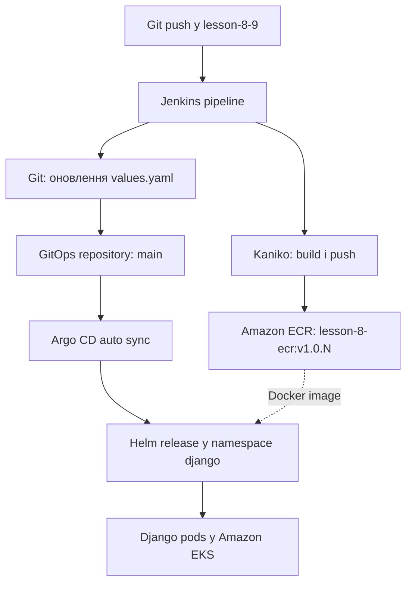
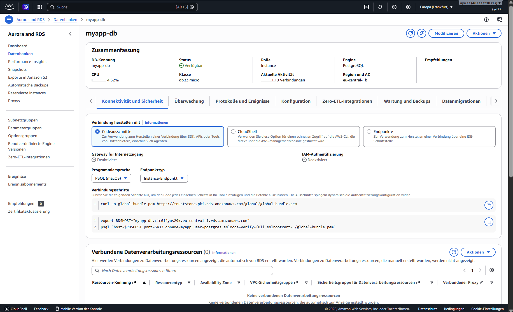

# Neoversity DevOps CI/CD Lab

Практична робота за заняттями 8–9 реалізує повний CI/CD-процес для Django-застосунку з використанням Jenkins, Helm, Terraform, Amazon ECR, Amazon EKS та Argo CD.

Після запуску Jenkins pipeline:

1. Docker-образ Django-застосунку збирається за допомогою Kaniko;
2. образ публікується в Amazon ECR;
3. Jenkins оновлює тег образу в Helm chart окремого GitOps-репозиторію;
4. Argo CD виявляє Git commit та автоматично синхронізує застосунок у кластері EKS.

## Репозиторії

| Призначення | Репозиторій | Гілка |
|---|---|---|
| Код застосунку, Dockerfile, Jenkinsfile і Terraform | [neoversity-devops-ci-cd-lab](https://github.com/ayri77/neoversity-devops-ci-cd-lab/tree/lesson-8-9) | `lesson-8-9` |
| GitOps Helm chart із бажаним станом застосунку | [neoversity-devops-gitops](https://github.com/ayri77/neoversity-devops-gitops) | `main` |

Контрольні версії успішного розгортання:

- основний репозиторій: commit `8da7e15`;
- GitOps-репозиторій: commit [`90e97fe`](https://github.com/ayri77/neoversity-devops-gitops/commit/90e97fe) — `Deploy lesson-8-ecr:v1.0.2`;
- Docker image: `lesson-8-ecr:v1.0.2`;
- Argo CD Application: `django-app`, стани `Healthy` і `Synced`;
- у кластері працюють дві репліки Django-застосунку.

## Архітектура

| Компонент | Призначення |
|---|---|
| Terraform | Створює AWS-інфраструктуру та встановлює Jenkins і Argo CD через Helm |
| Amazon VPC | Надає мережу з публічними та приватними підмережами |
| Amazon EKS | Запускає Jenkins, Argo CD і Django-застосунок |
| Amazon ECR | Зберігає версійовані Docker-образи |
| Jenkins | Оркеструє CI pipeline |
| Kubernetes Jenkins Agent | Запускає тимчасовий pod із контейнерами Kaniko та Git |
| Kaniko | Збирає і публікує образ без Docker daemon |
| GitOps-репозиторій | Зберігає Helm chart і бажаний тег образу |
| Argo CD | Відстежує GitOps-репозиторій та синхронізує кластер |
| Helm | Описує встановлення Jenkins, Argo CD та Django-застосунку |

Кластер `lesson-8-eks` використовує дві worker nodes типу `t3.small`. Jenkins працює в namespace `jenkins`, Argo CD — у `argocd`, а Django-застосунок — у `django`.

## Схема CI/CD



CI та CD розділені:

- Jenkins відповідає за збірку, публікацію образу та зміну GitOps-репозиторію;
- Argo CD не запускається безпосередньо з Jenkins, а самостійно реагує на зміну бажаного стану в Git.

## Структура проєктів

Основний репозиторій:

```text
neoversity-devops-ci-cd-lab/
├── Jenkinsfile
├── docker/
│   └── django/
│       ├── Dockerfile
│       ├── manage.py
│       └── requirements.txt
├── terraform/
│   ├── backend.tf
│   ├── main.tf
│   ├── outputs.tf
│   ├── providers.tf
│   ├── storage.tf
│   └── modules/
│       ├── argo-cd/
│       ├── ecr/
│       ├── eks/
│       ├── jenkins/
│       ├── s3-backend/
│       └── vpc/
└── docs/
    └── images/
```

GitOps-репозиторій:

```text
neoversity-devops-gitops/
└── charts/
    └── django-app/
        ├── Chart.yaml
        ├── values.yaml
        └── templates/
            ├── configmap.yaml
            ├── deployment.yaml
            ├── hpa.yaml
            ├── ingress.yaml
            ├── postgres.yaml
            └── service.yaml
```

Каталог `django-chart/` в основному репозиторії залишено як результат попереднього заняття з Helm. Argo CD для цієї роботи використовує лише chart `charts/django-app` з окремого GitOps-репозиторію.

## Застосування Terraform

### Передумови

Потрібні такі інструменти:

- AWS CLI;
- Terraform;
- `kubectl`;
- Helm;
- Git.

AWS CLI використовує профіль `neoversity`, регіон — `eu-central-1`.

Перевірка доступу до AWS:

```bash
aws sts get-caller-identity --profile neoversity
```

Для remote state використовується S3 backend:

- bucket: `pbori-neoversity-terraform-state`;
- key: `lesson-8/terraform.tfstate`;
- блокування: S3 native lockfile через `use_lockfile = true`.

Backend був створений у попередній практичній роботі та має існувати до виконання `terraform init`. Він навмисно не створюється тим самим запуском Terraform, який уже використовує цей backend.

### Звичайний запуск для наявного backend та кластера

З кореня основного репозиторію:

```bash
terraform -chdir=terraform init -reconfigure
terraform -chdir=terraform fmt -check -recursive
terraform -chdir=terraform validate
terraform -chdir=terraform plan
terraform -chdir=terraform apply
```

Після створення EKS потрібно оновити локальний Kubernetes context:

```bash
aws eks update-kubeconfig \
  --region eu-central-1 \
  --name lesson-8-eks \
  --profile neoversity
```

Базова перевірка:

```bash
terraform -chdir=terraform output
kubectl get nodes
helm list --all-namespaces
```

### Перший запуск після повного видалення інфраструктури

Порядок запуску важливий:

1. окремо відновити S3 backend;
2. створити VPC, ECR та EKS;
3. створити Kubernetes Secret із GitHub PAT;
4. виконати повний `terraform apply`, який встановить Jenkins і Argo CD.

Спочатку створюється базова AWS-інфраструктура:

```bash
terraform -chdir=terraform init -reconfigure

terraform -chdir=terraform apply \
  -target=module.vpc \
  -target=module.ecr \
  -target=module.eks
```

Після оновлення kubeconfig створюється namespace і Secret. Токен вводиться приховано та не записується в команду shell history:

```bash
kubectl create namespace jenkins \
  --dry-run=client \
  -o yaml | kubectl apply -f -

read -rsp "GitHub PAT: " GITHUB_TOKEN
echo

kubectl create secret generic jenkins-github-token \
  --namespace jenkins \
  --from-literal=GITHUB_TOKEN="$GITHUB_TOKEN" \
  --dry-run=client \
  -o yaml | kubectl apply -f -

unset GITHUB_TOKEN
```

Після цього застосовується повна Terraform-конфігурація:

```bash
terraform -chdir=terraform plan
terraform -chdir=terraform apply
```

GitHub PAT створюється поза Terraform, тому його значення не потрапляє до Git або Terraform state.

## Перевірка Jenkins

Перевірити Jenkins controller, agent pods, сервіс і persistent volume:

```bash
kubectl get pods,svc,pvc -n jenkins
```

Отримати початковий пароль користувача `admin`:

```bash
kubectl get secret jenkins \
  --namespace jenkins \
  -o jsonpath='{.data.jenkins-admin-password}' \
  | base64 --decode
echo
```

Зовнішню адресу Jenkins показує сервіс типу `LoadBalancer`:

```bash
kubectl get svc jenkins -n jenkins
```

Jenkins конфігурується автоматично через JCasC. Після першого встановлення:

1. відкрити job `seed-job`;
2. натиснути **Build Now**;
3. переконатися, що створено pipeline job `lesson-8-django-docker`;
4. відкрити `lesson-8-django-docker` і натиснути **Build Now**;
5. у Console Output перевірити успішне виконання stages:
   - `Build & Push Docker Image`;
   - `Update GitOps Repository`.

Тег формується як `v1.0.${BUILD_NUMBER}`. Наприклад, build №2 створив образ `v1.0.2`.

Перевірити образ в Amazon ECR:

```bash
aws ecr describe-images \
  --repository-name lesson-8-ecr \
  --region eu-central-1 \
  --profile neoversity \
  --query 'sort_by(imageDetails,&imagePushedAt)[-1].[imageTags[0],imagePushedAt]' \
  --output table
```

Перевірити зміну GitOps-репозиторію:

```bash
cd ~/project/neoversity-devops-gitops
git pull --ff-only
git log -1 --oneline
grep -A3 '^image:' charts/django-app/values.yaml
```

Для контрольного запуску очікуються commit `90e97fe` і тег `v1.0.2`.

## Перевірка результату в Argo CD

Перевірити компоненти Argo CD та адресу вебінтерфейсу:

```bash
kubectl get pods -n argocd
kubectl get svc argocd-server -n argocd
```

Отримати початковий пароль користувача `admin`:

```bash
kubectl get secret argocd-initial-admin-secret \
  --namespace argocd \
  -o jsonpath='{.data.password}' \
  | base64 --decode
echo
```

У вебінтерфейсі потрібно відкрити Application `django-app` і перевірити:

- `Sync Status: Synced`;
- `Health Status: Healthy`;
- увімкнений `Auto-Sync`;
- revision відповідає GitOps commit `90e97fe`;
- Deployment має дві запущені Django replicas.

Ті самі стани можна перевірити через `kubectl`:

```bash
kubectl get application django-app -n argocd

kubectl get application django-app \
  --namespace argocd \
  -o jsonpath='{.status.sync.status}{" / "}{.status.health.status}{"\n"}'

kubectl get deployment,pods,svc -n django -o wide

kubectl get deployment django-app-django \
  --namespace django \
  -o jsonpath='{.spec.template.spec.containers[0].image}{"\n"}'
```

Очікуваний результат останньої команди:

```text
487337210313.dkr.ecr.eu-central-1.amazonaws.com/lesson-8-ecr:v1.0.2
```

## Ключові особливості реалізації

### Окремий GitOps-репозиторій

Код застосунку та CI-конфігурація зберігаються окремо від бажаного стану Kubernetes. Jenkins не змінює manifests у своєму репозиторії, а створює commit у `neoversity-devops-gitops`. Завдяки цьому історія розгортань є окремою, а Argo CD має одне чітке джерело бажаного стану.

### Kubernetes Agent із двома контейнерами

Jenkins створює тимчасовий agent pod із двома спеціалізованими контейнерами:

- `kaniko` збирає та публікує Docker-образ;
- `git` змінює `values.yaml`, створює commit і виконує push.

Kaniko не потребує Docker daemon або монтування `/var/run/docker.sock` у pod.

### IRSA замість постійних AWS-ключів

ServiceAccount `jenkins-sa` пов'язаний з IAM role через IAM Roles for Service Accounts. Kaniko отримує тимчасові AWS credentials для публікації в ECR без збереження `AWS_ACCESS_KEY_ID` і `AWS_SECRET_ACCESS_KEY` у Jenkins.

### Jenkins Configuration as Code

Jenkins Helm values містять JCasC-конфігурацію та `seed-job`. Це дозволяє відновити jobs після повторного встановлення Jenkins і зменшує кількість ручних налаштувань у вебінтерфейсі.

### Автоматичне самовідновлення Argo CD

Application `django-app` має автоматичну політику синхронізації:

```yaml
automated:
  enabled: true
  prune: true
  selfHeal: true
```

Argo CD не лише застосовує нові Git commits, але й виправляє ручне відхилення стану кластера від стану в Git.

## Обґрунтування відмінностей від навчального прикладу

Загальна послідовність, передбачена завданням, не змінена: Jenkins збирає образ, публікує його в ECR та оновлює Git, після чого Argo CD синхронізує Helm chart. Відмінності стосуються безпеки, сумісності з актуальними версіями інструментів і стабільності навчального середовища.

| Рішення | Відмінність | Обґрунтування |
|---|---|---|
| Два окремі Git-репозиторії | Helm chart для Argo CD винесено з основного репозиторію | Це чітко розділяє CI-код і GitOps-стан та відповідає вимозі оновлювати `values.yaml` іншого репозиторію |
| Kubernetes Secret для GitHub PAT | Токен не передається через Terraform variables або Helm values | Інакше секрет міг би потрапити до Git, Terraform plan або remote state |
| IRSA для Jenkins Agent | Не використовуються статичні AWS access keys | Pod отримує короткоживучі credentials і лише необхідні права для ECR |
| Kaniko замість Docker-in-Docker | Образ збирається без Docker daemon | Не потрібні privileged container та доступ до Docker socket worker node |
| JCasC і seed job | Jobs не створюються повністю вручну | Конфігурація Jenkins стає відтворюваною та зберігається як код |
| Дві `t3.small` nodes | Замість однієї малої worker node використано дві | Одночасна робота Jenkins controller, agent pod, Argo CD і Django потребувала більше CPU та пам'яті; початкова конфігурація спричиняла проблеми з плануванням pods |
| EBS CSI Driver і `gp3` | Додано актуальний CSI driver і окремий StorageClass | Jenkins використовує persistent volume; для актуального EKS потрібен CSI provisioner, а `gp3` є сучаснішим типом EBS volume |
| `use_lockfile = true` для backend | Не використовується застарілий параметр `dynamodb_table` в S3 backend | Актуальна версія Terraform підтримує native S3 state locking; DynamoDB залишено лише як частину попередньої навчальної реалізації |
| Два Helm releases для Argo CD | Окремо встановлюються Argo CD та chart із ресурсом Application | Application створюється тільки після CRD Argo CD, що забезпечує правильний порядок залежностей |
| Скорочена конфігурація Argo CD | Dex, Notifications та ApplicationSet вимкнені | Ці компоненти не потрібні для завдання і зайво споживали б ресурси навчального кластера |

## Безпека та файли, які не додаються до Git

`.gitignore` виключає:

```text
.venv/
.env
docker/.env
.terraform/
*.tfstate
*.tfstate.*
*.tfvars
*.tfvars.json
```

Додаткові заходи:

- GitHub PAT зберігається в Kubernetes Secret;
- AWS access keys не використовуються в Jenkins — доступ надає IRSA;
- перед `git push` у Jenkinsfile виконується `set +x`, тому команда з токеном не виводиться в build log;
- Terraform state зберігається у приватному зашифрованому S3 bucket;
- `.terraform.lock.hcl` зберігається в Git, оскільки він фіксує версії providers і не містить секретів.

Значення `SECRET_KEY` та `POSTGRES_PASSWORD` у навчальному Django chart є тестовими значеннями для ізольованого середовища. У production-середовищі їх необхідно зберігати в Kubernetes Secret або зовнішньому сховищі секретів.

Перед створенням архіву потрібно переконатися, що локальні state, `.env`, кеші та віртуальне середовище до нього не потрапляють.

## Докази виконання

### Успішний Jenkins pipeline


### Стан Argo CD Application

На скриншоті видно Application `django-app`, GitOps-репозиторій, гілку `main` та стани `Healthy` і `Synced`.


### Автоматична синхронізація та ресурси застосунку

На скриншоті мають бути видимі `Healthy`, `Synced`, revision `90e97fe`, Jenkins CI commit і дві запущені Django replicas.


## Фінальна перевірка перед здачею

Перевірити форматування та Terraform-конфігурацію:

```bash
terraform -chdir=terraform fmt -check -recursive
terraform -chdir=terraform validate
terraform -chdir=terraform plan -detailed-exitcode
```

Для `terraform plan -detailed-exitcode`:

- exit code `0` означає, що змін немає;
- exit code `1` означає помилку;
- exit code `2` означає, що Terraform планує зміни.

Перевірити Git:

```bash
git status --short --branch
git log --oneline --decorate --max-count=8
git ls-files | grep -E '(^|/)\.env$|\.tfstate($|\.)' || true
```

Остання команда не повинна показати `.env` або Terraform state files.

## Видалення ресурсів після здачі

AWS-ресурси потрібно видаляти лише після завершення всіх перевірок, збереження скриншотів та здачі роботи:

```bash
terraform -chdir=terraform destroy
```

S3 backend видаляється останнім, коли його state більше не потрібен. Якщо backend, EKS та інші ресурси були видалені повністю, наступне розгортання необхідно знову починати зі створення backend, а не з `terraform init` основної конфігурації.

## Lesson DB Module — універсальний модуль Amazon RDS та Aurora

Гілка [`lesson-db-module`](https://github.com/ayri77/neoversity-devops-ci-cd-lab/tree/lesson-db-module) містить універсальний Terraform-модуль для створення керованої реляційної бази даних в AWS.

Залежно від значення `use_aurora` модуль створює:

- `use_aurora = false` — один стандартний Amazon RDS instance;
- `use_aurora = true` — Amazon Aurora cluster, один writer та налаштовувану кількість reader instances.

Модуль підтримує:

- PostgreSQL та MySQL для стандартної RDS;
- Aurora PostgreSQL та Aurora MySQL;
- DB Subnet Group;
- Security Group;
- окремі parameter groups для RDS та Aurora;
- шифрування сховища;
- автоматичні резервні копії;
- Multi-AZ для стандартної RDS;
- writer і reader endpoints для Aurora;
- безпечне передавання пароля без його збереження в Git.

### Структура модуля

```text
terraform/modules/rds/
├── aurora.tf      # Aurora cluster, writer, readers і cluster parameter group
├── outputs.tf     # RDS, Aurora та універсальні outputs
├── rds.tf         # Стандартний RDS instance і DB parameter group
├── shared.tf      # DB Subnet Group і Security Group
└── variables.tf   # Типізовані вхідні змінні
```

Спільні DB Subnet Group та Security Group створюються в обох режимах. Parameter group вибирається умовно:

| Режим | Основні ресурси |
|---|---|
| `use_aurora = false` | `aws_db_instance`, `aws_db_parameter_group` |
| `use_aurora = true` | `aws_rds_cluster`, `aws_rds_cluster_instance`, `aws_rds_cluster_parameter_group` |
| Обидва режими | `aws_db_subnet_group`, `aws_security_group` |

### Приклад використання

```hcl
module "rds" {
  source = "./modules/rds"

  name                  = "myapp-db"
  use_aurora            = false
  aurora_instance_count = 2

  # Aurora-only configuration
  engine_cluster                = "aurora-postgresql"
  engine_version_cluster        = "15.17"
  parameter_group_family_aurora = "aurora-postgresql15"

  # Standard RDS-only configuration
  engine                     = "postgres"
  engine_version             = "17.10"
  parameter_group_family_rds = "postgres17"
  allocated_storage          = 20
  multi_az                   = false

  # Common database configuration
  instance_class = "db.t3.medium"
  db_name        = "myapp"
  username       = "postgres"
  password       = var.db_password
  port           = 5432

  # Network configuration
  vpc_id             = module.vpc.vpc_id
  subnet_private_ids = module.vpc.private_subnets
  subnet_public_ids  = module.vpc.public_subnets

  publicly_accessible = false
  allowed_cidr_blocks = ["10.0.0.0/16"]

  # Backups and protection
  backup_retention_period = 1
  storage_encrypted       = true
  deletion_protection     = false
  skip_final_snapshot     = true

  parameters = {
    max_connections            = "200"
    log_statement              = "ddl"
    work_mem                   = "4096"
    log_min_duration_statement = "500"
  }

  tags = {
    Environment = "dev"
    Project     = "myapp"
  }
}
```

Пароль оголошений як sensitive variable і не має значення за замовчуванням:

```hcl
variable "db_password" {
  description = "Master password for the database"
  type        = string
  sensitive   = true
}
```

### Вхідні змінні модуля

| Змінна | Тип | Значення за замовчуванням | Призначення |
|---|---|---|---|
| `name` | `string` | обов’язкова | Ім’я стандартного RDS instance або базове ім’я Aurora cluster |
| `use_aurora` | `bool` | `false` | Перемикає модуль між стандартною RDS та Aurora |
| `engine` | `string` | `"postgres"` | Engine стандартної RDS: `postgres` або `mysql` |
| `engine_version` | `string` | `"17.10"` | Версія engine стандартної RDS |
| `parameter_group_family_rds` | `string` | `"postgres17"` | Родина parameter group для стандартної RDS |
| `instance_class` | `string` | `"db.t3.micro"` | Клас instance для стандартної RDS або Aurora |
| `allocated_storage` | `number` | `20` | Обсяг сховища стандартної RDS у GiB |
| `db_name` | `string` | обов’язкова | Ім’я початкової бази даних |
| `username` | `string` | обов’язкова | Ім’я master-користувача бази даних |
| `password` | `string`, sensitive | обов’язкова | Пароль master-користувача; не зберігається в Git |
| `vpc_id` | `string` | обов’язкова | ID VPC, у якій створюється база |
| `subnet_private_ids` | `list(string)` | обов’язкова | Приватні subnet IDs для внутрішньої бази |
| `subnet_public_ids` | `list(string)` | `[]` | Публічні subnet IDs для режиму `publicly_accessible = true` |
| `publicly_accessible` | `bool` | `false` | Дозволяє створення публічно доступного endpoint |
| `port` | `number` | `5432` | Порт бази: зазвичай `5432` для PostgreSQL або `3306` для MySQL |
| `allowed_cidr_blocks` | `list(string)` | `[]` | CIDR-блоки, яким Security Group дозволяє підключення |
| `multi_az` | `bool` | `false` | Вмикає Multi-AZ для стандартної RDS |
| `backup_retention_period` | `number` | `7` | Кількість днів зберігання автоматичних резервних копій |
| `parameters` | `map(string)` | `{}` | Параметри для parameter group вибраного типу бази |
| `storage_encrypted` | `bool` | `true` | Вмикає шифрування сховища |
| `deletion_protection` | `bool` | `false` | Захищає базу або cluster від випадкового видалення |
| `skip_final_snapshot` | `bool` | `true` | Визначає, чи пропускати фінальний snapshot під час видалення |
| `tags` | `map(string)` | `{}` | AWS tags для створених ресурсів |
| `engine_cluster` | `string` | `"aurora-postgresql"` | Aurora engine: `aurora-postgresql` або `aurora-mysql` |
| `engine_version_cluster` | `string` | `"15.17"` | Версія Aurora engine |
| `parameter_group_family_aurora` | `string` | `"aurora-postgresql15"` | Родина Aurora cluster parameter group |
| `aurora_instance_count` | `number` | `2` | Загальна кількість Aurora instances, включно з одним writer |

Змінні без default є обов’язковими, оскільки залежать від конкретного середовища. Для `password` значення за замовчуванням навмисно відсутнє, щоб пароль не зберігався у вихідному коді.

### Як змінити тип бази даних

#### Стандартна RDS PostgreSQL

Для створення звичайного PostgreSQL instance:

```hcl
use_aurora                = false
engine                    = "postgres"
engine_version            = "17.10"
parameter_group_family_rds = "postgres17"
port                      = 5432
```

У цьому режимі створюються:

- один `aws_db_instance`;
- стандартна `aws_db_parameter_group`;
- DB Subnet Group;
- Security Group.

#### Стандартна RDS MySQL

Для переходу на MySQL потрібно змінити engine, його версію, parameter group family, порт і engine-specific parameters:

```hcl
use_aurora                 = false
engine                     = "mysql"
engine_version             = "<supported MySQL version>"
parameter_group_family_rds = "<matching MySQL family>"
port                       = 3306
```

Версія engine та parameter group family повинні бути сумісними й доступними у вибраному AWS Region.

Параметри `log_statement` і `work_mem` належать PostgreSQL. Для MySQL у `parameters` потрібно передати параметри, які підтримує відповідна MySQL parameter group.

#### Aurora PostgreSQL

У поточному прикладі Aurora PostgreSQL уже налаштована. Для перемикання достатньо змінити прапор:

```hcl
use_aurora = true
```

Aurora-specific значення:

```hcl
engine_cluster                = "aurora-postgresql"
engine_version_cluster        = "15.17"
parameter_group_family_aurora = "aurora-postgresql15"
instance_class                = "db.t3.medium"
aurora_instance_count         = 2
port                          = 5432
```

За значення `aurora_instance_count = 2` створюються:

- один writer;
- один reader.

Якщо встановити:

```hcl
aurora_instance_count = 1
```

буде створено лише writer. Кількість readers обчислюється як `aurora_instance_count - 1`.

#### Aurora MySQL

Для Aurora MySQL потрібно змінити Aurora engine, версію, parameter group family, порт і parameters:

```hcl
use_aurora                   = true
engine_cluster               = "aurora-mysql"
engine_version_cluster       = "<supported Aurora MySQL version>"
parameter_group_family_aurora = "<matching Aurora MySQL family>"
port                         = 3306
```

#### Зміна класу instance

Клас обчислювальних ресурсів задається однією змінною:

```hcl
instance_class = "db.t3.medium"
```

Перед застосуванням потрібно перевірити, що вибраний клас підтримує відповідні engine, engine version та AWS Region.

#### Multi-AZ і кількість реплік

Для стандартної RDS Multi-AZ вмикається так:

```hcl
multi_az = true
```

Змінна `multi_az` використовується лише стандартною RDS. Aurora має власну кластерну модель відмовостійкості, а кількість її compute instances задається через `aurora_instance_count`.

### Запуск Terraform

#### Передумови

Потрібні:

- Terraform;
- AWS CLI;
- AWS profile `neoversity`;
- створений S3 backend для Terraform state.

Перевірка AWS credentials:

```bash
aws sts get-caller-identity --profile neoversity
```

#### Безпечне передавання пароля

Пароль не записується в Git або в committed `.tfvars` file. У WSL його можна передати через environment variable:

```bash
read -s -p "DB password: " TF_VAR_db_password
echo
export TF_VAR_db_password
```

Значення позначене як `sensitive`, тому Terraform приховує його у звичайному CLI output. Водночас database password може зберігатися у Terraform state, тому remote state повинен бути приватним і зашифрованим.

#### Форматування та перевірка

З кореня репозиторію:

```bash
terraform -chdir=terraform init -reconfigure
terraform -chdir=terraform fmt -check -recursive
terraform -chdir=terraform validate
terraform -chdir=terraform plan
```

Після перевірки plan:

```bash
terraform -chdir=terraform apply
```

Після завершення роботи зі змінною:

```bash
unset TF_VAR_db_password
```

Параметр `-target=module.rds` використовувався лише для ізольованої перевірки database module у навчальному репозиторії, який також містить EKS, Jenkins та Argo CD:

```bash
terraform -chdir=terraform plan -target=module.rds
terraform -chdir=terraform apply -target=module.rds
```

`-target` не призначений для звичайного повного розгортання. Для стандартного запуску всієї конфігурації потрібно використовувати `terraform plan` і `terraform apply` без targeting.

### Перевірка результату

Універсальні Terraform outputs:

```bash
terraform -chdir=terraform output database_endpoint
terraform -chdir=terraform output database_port
terraform -chdir=terraform output rds_security_group_id
terraform -chdir=terraform output rds_subnet_group_name
```

Для Aurora додатково доступні:

```bash
terraform -chdir=terraform output database_reader_endpoint
terraform -chdir=terraform output aurora_cluster_identifier
terraform -chdir=terraform output aurora_writer_instance_identifier
terraform -chdir=terraform output aurora_reader_instance_identifiers
```

#### Перевірка стандартної RDS

```bash
aws rds describe-db-instances \
  --db-instance-identifier myapp-db \
  --region eu-central-1 \
  --profile neoversity \
  --query "DBInstances[0].{Identifier:DBInstanceIdentifier,Status:DBInstanceStatus,Engine:Engine,Version:EngineVersion,Class:DBInstanceClass,MultiAZ:MultiAZ,Public:PubliclyAccessible,Encrypted:StorageEncrypted,Endpoint:Endpoint.Address,Port:Endpoint.Port}" \
  --output table
```

Очікуваний стан після створення — `available`.

#### Перевірка Aurora

```bash
aws rds describe-db-clusters \
  --db-cluster-identifier myapp-db-cluster \
  --region eu-central-1 \
  --profile neoversity \
  --query "DBClusters[0].{Identifier:DBClusterIdentifier,Status:Status,Engine:Engine,Version:EngineVersion,WriterEndpoint:Endpoint,ReaderEndpoint:ReaderEndpoint,Encrypted:StorageEncrypted}" \
  --output table
```

Перевірка writer і reader instances:

```bash
aws rds describe-db-instances \
  --region eu-central-1 \
  --profile neoversity \
  --filters "Name=db-cluster-id,Values=myapp-db-cluster" \
  --query "DBInstances[].{Identifier:DBInstanceIdentifier,Status:DBInstanceStatus,Class:DBInstanceClass,AZ:AvailabilityZone}" \
  --output table
```

### Доказ створення стандартної RDS

Під час практичної перевірки було успішно створено приватний зашифрований PostgreSQL RDS instance версії `17.10`.



### Особливість AWS Free Plan

Стандартний PostgreSQL RDS instance був успішно створений і перевірений у AWS.

Для Aurora Terraform сформував коректний plan:

```text
Plan: 4 to add, 0 to change, 2 to destroy
```

Plan передбачав створення:

- Aurora cluster parameter group;
- Aurora cluster;
- writer instance;
- reader instance.

Під час `apply` AWS відхилив створення повністю конфігурованого Aurora cluster через обмеження поточного AWS Free Plan:

```text
FreeTierRestrictionError:
To use Aurora clusters with free plan accounts
you need to set WithExpressConfiguration.
```

AWS Free Plan дозволяє створення Aurora PostgreSQL через [Express Configuration](https://docs.aws.amazon.com/AmazonRDS/latest/AuroraUserGuide/CHAP_GettingStartedAurora.AuroraPostgreSQL.ExpressConfig.html), яка автоматично створює Aurora Serverless cluster і writer.

Express Configuration не була використана, оскільки:

- вона відрізняється від архітектури домашнього завдання;
- автоматично створює Serverless writer замість окремо керованих Terraform resources;
- не відповідає сценарію з власними DB Subnet Group, Security Group, writer і reader instances;
- AWS provider, використаний у проєкті, не підтримує `WithExpressConfiguration` у `aws_rds_cluster`. Підтримка відстежується у [HashiCorp issue #47117](https://github.com/hashicorp/terraform-provider-aws/issues/47117).

Тому кореневий приклад залишено у запускаемому для поточного акаунта режимі:

```hcl
use_aurora = false
```

Aurora-частина модуля збережена як повна Terraform-конфігурація для AWS account без обмеження Free Plan.

### Обґрунтування відмінностей від навчального конспекту

| Відмінність | Реалізація | Обґрунтування |
|---|---|---|
| Версія стандартного PostgreSQL | `17.10` замість `17.2` | Версія `17.2` недоступна в `eu-central-1`; через AWS CLI підтверджено підтримку `17.10` і family `postgres17` |
| Версія Aurora PostgreSQL | `15.17` замість `15.3` | Версія `15.3` недоступна в регіоні; підтверджено `15.17` і family `aurora-postgresql15` |
| Пароль | `var.db_password` без default | Hardcoded password із конспекту міг би потрапити до Git; значення передається через `TF_VAR_db_password` |
| Доступ до бази | `publicly_accessible = false` | База розміщується у private subnets і не має прямого доступу з інтернету |
| Security Group | Доступ лише з `10.0.0.0/16` | Порт бази не відкривається для `0.0.0.0/0` |
| Шифрування | `storage_encrypted = true` | Дані шифруються у сховищі AWS |
| Очищення training environment | `skip_final_snapshot = true`, `deletion_protection = false` | Дозволяє повністю видалити навчальні ресурси після перевірки; для production ці значення потрібно змінити |
| Кількість Aurora instances | `aurora_instance_count` означає загальну кількість instances | У конспекті одночасно використовувалися різні назви `aurora_instance_count` і `aurora_replica_count`; одна змінна усуває неоднозначність |
| Порядок створення Aurora | Reader має `depends_on` від writer | Writer гарантовано створюється першим, а під час destroy reader видаляється раніше writer |
| Parameter group | Додано `max_connections`, `log_statement`, `work_mem` і `log_min_duration_statement` | Перші три параметри прямо вимагає домашнє завдання; останній залишено як додатковий параметр із практики |
| Aurora у Free Plan | Live apply не виконувався через обмеження акаунта | Заміна на Express Configuration порушила б структуру та вимоги завдання |

### Видалення ресурсів

Після збереження доказів і завершення перевірки всі створені ресурси потрібно видалити:

```bash
read -s -p "DB password: " TF_VAR_db_password
echo
export TF_VAR_db_password

terraform -chdir=terraform destroy

unset TF_VAR_db_password
```

Після destroy потрібно перевірити state:

```bash
terraform -chdir=terraform state list
```

Основна конфігурація використовує вже створений remote S3 backend. Його bucket не створюється модулем у цьому запуску, тому звичайний `terraform destroy` основної конфігурації не видаляє backend до завершення роботи зі state.