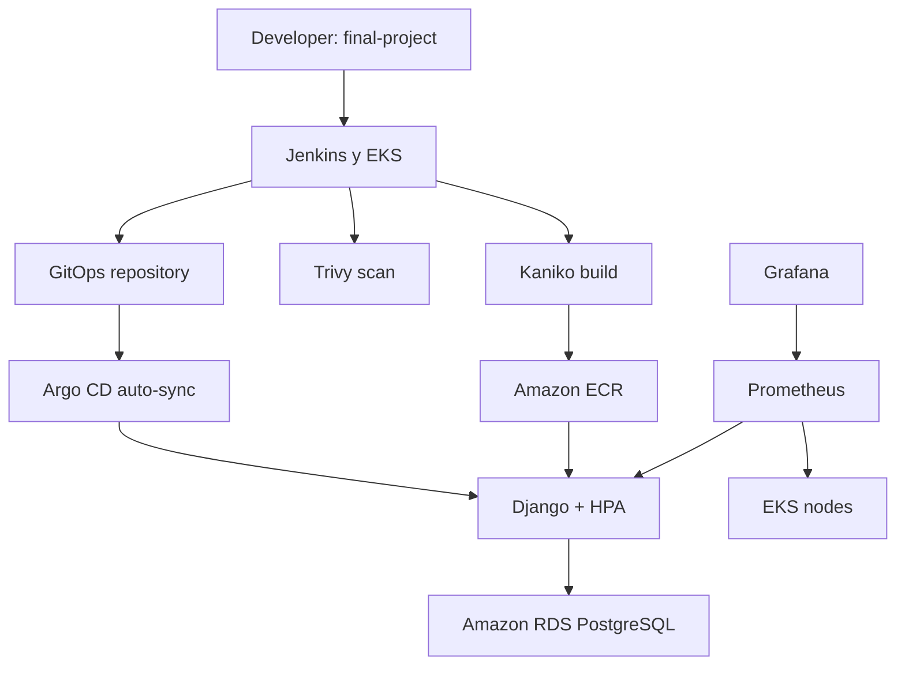
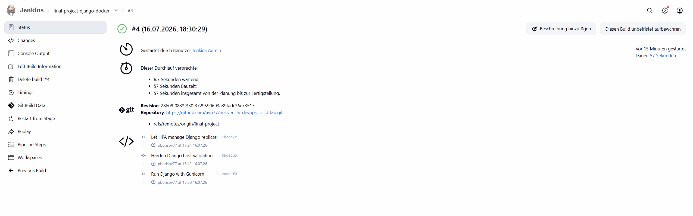
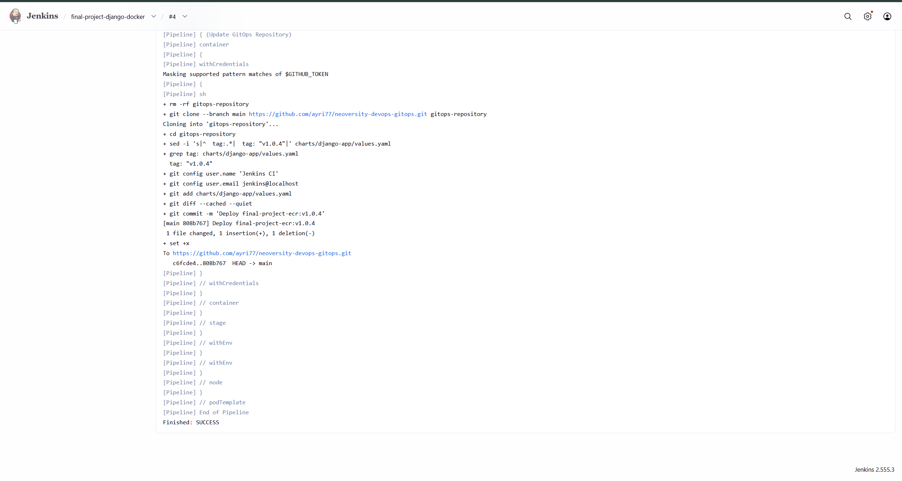
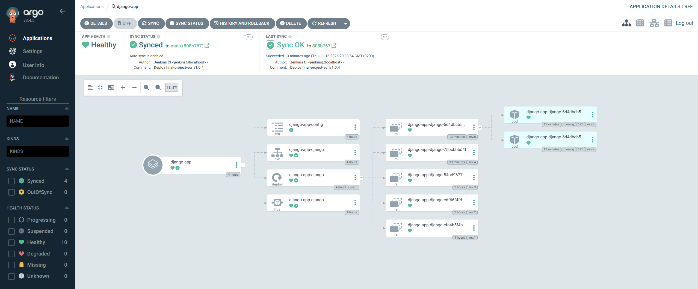
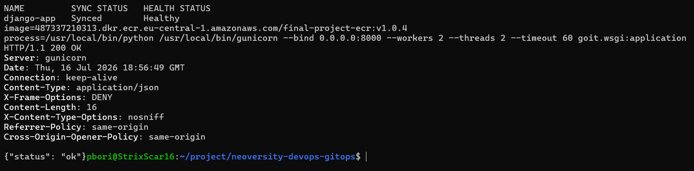
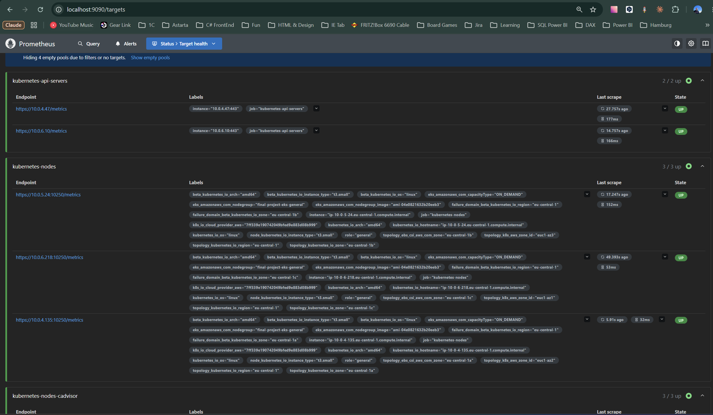
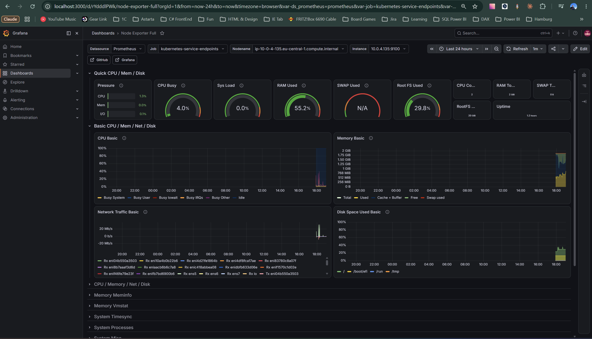
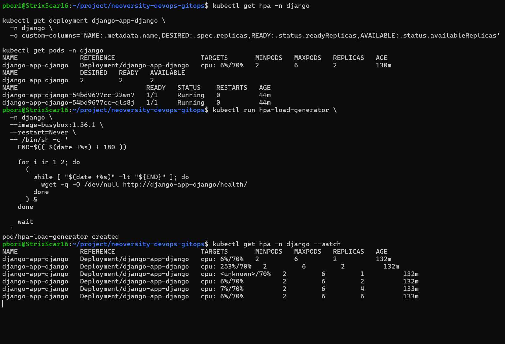
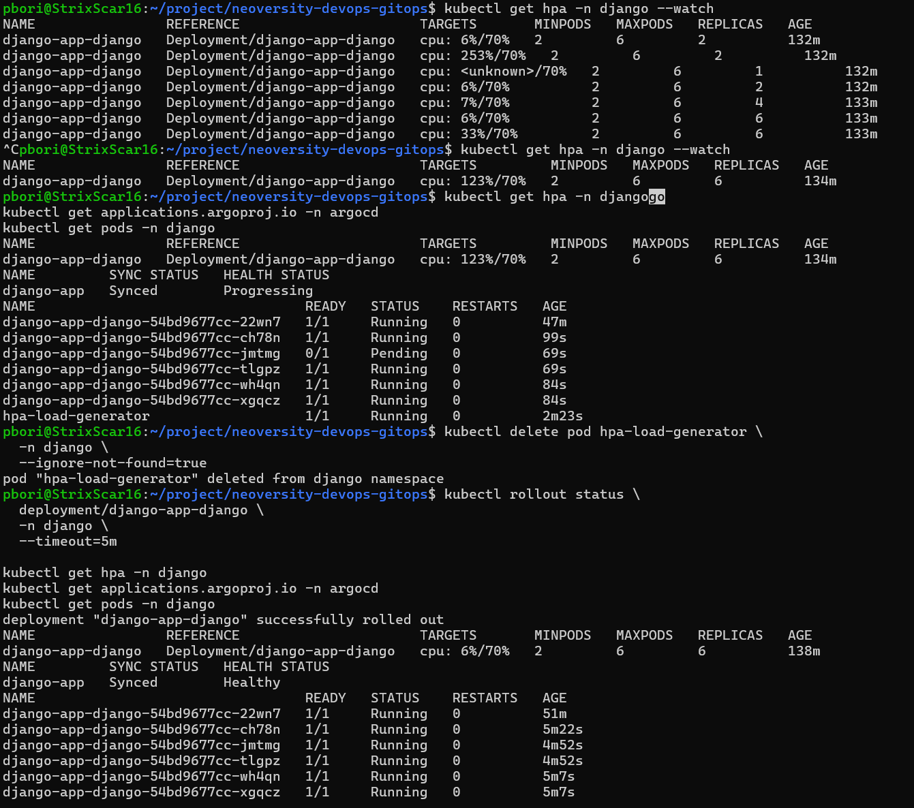

# Фінальний DevOps-проєкт: інфраструктура на AWS

Фінальний проєкт курсу **DevOps CI/CD** об’єднує попередні практичні роботи в єдину інфраструктуру на AWS. Ресурси створюються за допомогою Terraform, застосунок працює в Amazon EKS, Jenkins виконує CI, Argo CD — GitOps-доставку, а Prometheus і Grafana забезпечують моніторинг.

> **Гілка для перевірки:** [`final-project`](https://github.com/ayri77/neoversity-devops-ci-cd-lab/tree/final-project)
>
> **GitOps-репозиторій:** [`neoversity-devops-gitops`](https://github.com/ayri77/neoversity-devops-gitops)
>
> **Контрольний результат:** Jenkins build №4 — `SUCCESS`, образ `final-project-ecr:v1.0.4`, Argo CD — `Synced / Healthy`, `/health/` — `HTTP 200`.

## Зміст

- [Результат](#результат)
- [Архітектура](#архітектура)
- [Компоненти](#компоненти)
- [Структура репозиторіїв](#структура-репозиторіїв)
- [Передумови](#передумови)
- [Підготовка секретів](#підготовка-секретів)
- [Розгортання Terraform](#розгортання-terraform)
- [Перевірка Kubernetes](#перевірка-kubernetes)
- [CI/CD з Jenkins та Argo CD](#cicd-з-jenkins-та-argo-cd)
- [Доступ до сервісів](#доступ-до-сервісів)
- [Моніторинг](#моніторинг)
- [Автомасштабування](#автомасштабування)
- [База даних](#база-даних)
- [Безпека](#безпека)
- [Фінальна перевірка](#фінальна-перевірка)
- [Видалення ресурсів](#видалення-ресурсів)
- [Попередні практичні роботи](#попередні-практичні-роботи)

## Результат

Під час контрольного розгортання перевірено:

| Перевірка | Результат |
| --- | --- |
| Terraform | `No changes. Your infrastructure matches the configuration.` |
| Amazon EKS | три Ready worker nodes `t3.small`, Kubernetes `1.36` |
| Jenkins | pipeline `final-project-django-docker`, build №4 — `SUCCESS` |
| Amazon ECR | immutable tags, AES-256, scan on push, образ `v1.0.4` |
| Trivy | перевірка образу на CRITICAL CVE пройдена |
| Argo CD | Application `django-app` — `Synced / Healthy` |
| Django | дві базові репліки, Gunicorn, `/health/` повертає `HTTP 200` |
| Amazon RDS | PostgreSQL `17.10`, статус `available`, приватний та зашифрований |
| Prometheus | Kubernetes API, nodes, cAdvisor та service endpoints — `UP` |
| Grafana | Prometheus Data Source працює, імпортовано Node Exporter Full dashboard |
| HPA | масштабування Django з 2 до 6 Pod і повернення до 2 після завершення навантаження |

Відповідність критеріям оцінювання:

| Критерій | Реалізація |
| --- | --- |
| Коректна архітектура | VPC, публічні й приватні subnet, NAT Gateway, EKS, ECR, RDS |
| Безпека | приватна RDS, обмежений EKS API, IRSA, Security Groups, write-only secrets, Trivy |
| Застосунок і CI/CD | Kaniko → ECR → GitOps commit → Argo CD → Helm deployment |
| Моніторинг і масштабування | Prometheus, Grafana, Metrics Server, HPA |
| Документація | повний порядок розгортання, перевірки, демонстрації та очищення ресурсів |

## Архітектура



Мережева схема:

- VPC: `10.0.0.0/16`;
- три публічні subnet: `10.0.1.0/24`–`10.0.3.0/24`;
- три приватні subnet: `10.0.4.0/24`–`10.0.6.0/24`;
- регіон: `eu-central-1`;
- Availability Zones: `eu-central-1a`, `eu-central-1b`, `eu-central-1c`;
- worker nodes EKS і RDS розміщені у приватних subnet;
- вихід із приватних subnet до інтернету здійснюється через NAT Gateway;
- зовнішній доступ до Django надає Kubernetes Service типу `LoadBalancer`;
- Jenkins, Argo CD, Prometheus і Grafana використовують `ClusterIP` та доступні локально через port-forward.

## Компоненти

| Компонент | Реалізація |
| --- | --- |
| IaC | Terraform `1.15+` |
| Cloud | AWS, регіон `eu-central-1` |
| Network | VPC, Internet Gateway, NAT Gateway, route tables, 6 subnet |
| Kubernetes | Amazon EKS `1.36`, managed node group, 3× `t3.small` |
| Storage | Amazon EBS CSI Driver, default StorageClass `gp3` |
| Registry | Amazon ECR `final-project-ecr` |
| Database | Amazon RDS PostgreSQL `17.10`, `db.t3.micro` |
| CI | Jenkins Helm chart `5.9.32`, JCasC, Job DSL, Kubernetes Agent |
| Image build | Kaniko `v1.16.0-debug` без Docker daemon |
| Security scan | Trivy `0.72.0` |
| CD | Argo CD Helm chart `10.1.3`, automated sync, prune, self-heal |
| Application | Django `5.2.16`, Gunicorn `26.0.0`, Helm chart |
| Monitoring | Prometheus `29.17.0`, Grafana `12.7.2`, Metrics Server `3.13.1` |
| Autoscaling | HorizontalPodAutoscaler: 2–6 Pod, CPU target 70% |

Модуль `rds` підтримує два режими через `use_aurora`:

- `false` — стандартний Amazon RDS;
- `true` — Amazon Aurora cluster з writer та reader instances.

У контрольному розгортанні використано RDS PostgreSQL (`use_aurora = false`) як достатній і економніший варіант для вимоги **RDS або Aurora**.

## Структура репозиторіїв

Основний репозиторій:

```text
neoversity-devops-ci-cd-lab/
├── Jenkinsfile
├── README.md
├── django-chart/                  # локальна копія Helm chart
├── docker/
│   └── django/
│       ├── Dockerfile
│       ├── requirements.txt
│       ├── manage.py
│       └── goit/
├── images/
│   └── final-project/             # докази контрольного розгортання
└── terraform/
    ├── backend.tf
    ├── django.tf                  # namespace і write-only Secret застосунку
    ├── main.tf
    ├── outputs.tf
    ├── providers.tf
    ├── storage.tf                 # encrypted gp3 StorageClass
    ├── variables.tf
    └── modules/
        ├── argo-cd/
        ├── ecr/
        ├── eks/
        ├── jenkins/
        ├── monitoring/
        ├── rds/
        ├── s3-backend/
        └── vpc/
```

GitOps-репозиторій:

```text
neoversity-devops-gitops/
└── charts/
    └── django-app/
        ├── Chart.yaml
        ├── values.yaml
        └── templates/
            ├── configmap.yaml
            ├── deployment.yaml
            ├── hpa.yaml
            ├── ingress.yaml
            └── service.yaml
```

Argo CD використовує саме chart із GitOps-репозиторію. Каталог `django-chart/` в основному репозиторії збережено як локальний приклад і синхронізовано з контрольним образом `v1.0.4`.

## Передумови

Необхідні інструменти:

- AWS CLI;
- Terraform;
- `kubectl`;
- Helm;
- Git;
- `curl`, `openssl`, `base64`;
- AWS profile `neoversity` з необхідними IAM permissions.

Перевірка:

```bash
aws sts get-caller-identity --profile neoversity
terraform version
kubectl version --client
helm version
```

Terraform використовує remote S3 backend:

```text
bucket: pbori-neoversity-terraform-state
key:    final-project/terraform.tfstate
region: eu-central-1
lock:   native S3 lockfile
```

Backend bucket був створений окремо під час попередньої практичної роботи. Він навмисно не створюється тим самим запуском, який уже використовує цей backend.

Модуль `modules/s3-backend` зберігає навчальний варіант bootstrap через S3 і DynamoDB. Активний backend фінального проєкту використовує актуальне native S3 locking (`use_lockfile = true`), тому окрема DynamoDB table для блокування state у цьому запуску не потрібна.

## Підготовка секретів

Секрети не зберігаються у Git, `.tfvars` або Terraform state. Кореневі variables позначені як `sensitive` та `ephemeral`, а ресурси використовують write-only attributes:

- `github_token` → Kubernetes Secret `jenkins-github-token` через `data_wo`;
- `db_password` → RDS через `password_wo`;
- `django_secret_key` та реквізити RDS → Kubernetes Secret `django-app-secrets` через `data_wo`.

Змінні потрібно задати в поточній WSL-сесії перед `plan`, `apply` або `destroy`:

```bash
cd ~/project/neoversity-devops-ci-cd-lab

PUBLIC_IP="$(curl -fsS https://checkip.amazonaws.com | tr -d '\r\n')"
export TF_VAR_eks_public_access_cidrs="[\"${PUBLIC_IP}/32\"]"

read -rsp "RDS password: " TF_VAR_db_password
echo
export TF_VAR_db_password

read -rsp "GitHub PAT: " TF_VAR_github_token
echo
export TF_VAR_github_token

export TF_VAR_django_secret_key="$(openssl rand -hex 32)"
```

Для fine-grained GitHub PAT достатньо надати доступ до репозиторію `neoversity-devops-gitops` і permission **Contents: Read and write**. Токен вводиться приховано й не повинен з’являтися в командах, логах або README.

Значення revision variables збільшуються лише під час ротації відповідного секрету:

```text
github_token_revision
db_password_revision
django_secret_revision
```

## Розгортання Terraform

Форматування та валідація:

```bash
terraform -chdir=terraform fmt -check -recursive
terraform -chdir=terraform init -reconfigure
terraform -chdir=terraform validate
```

Створення збереженого plan:

```bash
terraform -chdir=terraform plan \
  -out=/tmp/final-project.tfplan
```

Розгортання:

```bash
terraform -chdir=terraform apply \
  /tmp/final-project.tfplan
```

Еквівалентний прямий запуск без збереженого plan:

```bash
terraform -chdir=terraform apply
```

Після створення EKS потрібно оновити локальний kubeconfig:

```bash
aws eks update-kubeconfig \
  --region eu-central-1 \
  --name final-project-eks \
  --profile neoversity
```

Основні Terraform outputs:

```bash
terraform -chdir=terraform output
```

Серед них: VPC і subnet IDs, ECR URL, EKS endpoint, RDS endpoint, namespaces, Helm releases та імена monitoring services.

## Перевірка Kubernetes

```bash
kubectl get nodes -o wide

kubectl get all -n jenkins
kubectl get all -n argocd
kubectl get all -n monitoring
kubectl get all -n django

kubectl get pvc -A
kubectl get hpa -n django
kubectl top nodes
```

Пошук Pod, які не перебувають у штатному стані:

```bash
kubectl get pods -A \
  --field-selector='status.phase!=Running,status.phase!=Succeeded'
```

Під час першого розгортання Django може тимчасово мати `ImagePullBackOff`, поки ECR ще порожній. Після першого успішного Jenkins build тег у GitOps-репозиторії оновлюється, і Argo CD автоматично завершує rollout.

## CI/CD з Jenkins та Argo CD

### CI — Jenkins

Jenkins налаштований через Helm і JCasC. Після першого входу потрібно один раз запустити `seed-job`; він створює pipeline `final-project-django-docker` з `Jenkinsfile` гілки `final-project`.

Pipeline виконує три stages:

1. **Build & Push Docker Image** — Kaniko створює образ і публікує його в Amazon ECR;
2. **Scan Docker Image** — Trivy перевіряє образ на CRITICAL vulnerabilities і зупиняє pipeline при знайденій виправній критичній CVE;
3. **Update GitOps Repository** — Jenkins змінює `image.tag`, створює Git commit і виконує push у GitOps-репозиторій.

Формат тегу:

```text
v1.0.${BUILD_NUMBER}
```

Jenkins Agent працює як тимчасовий Kubernetes Pod із контейнерами `kaniko`, `trivy` та `git`. Доступ до ECR реалізовано через IRSA service account `jenkins-sa`, без статичних AWS credentials.



Лог демонструє masked GitHub token, зміну тегу на `v1.0.4`, commit, push та завершення pipeline зі статусом `SUCCESS`:



### CD — Argo CD

Argo CD Application `django-app` відстежує:

```text
repository: https://github.com/ayri77/neoversity-devops-gitops.git
branch:     main
path:       charts/django-app
namespace:  django
```

Увімкнено:

- automated sync;
- prune;
- self-heal;
- автоматичне створення namespace.

Jenkins не виконує прямий `kubectl apply`: бажаний стан змінюється тільки через Git, після чого Argo CD синхронізує кластер.



Перевірка з CLI:

```bash
kubectl get applications.argoproj.io -n argocd

kubectl rollout status \
  deployment/django-app-django \
  -n django \
  --timeout=10m

kubectl get deployment django-app-django \
  -n django \
  -o jsonpath='{.spec.template.spec.containers[0].image}{"\n"}'
```

## Доступ до сервісів

### Jenkins

```bash
kubectl port-forward \
  svc/jenkins 8080:8080 \
  -n jenkins
```

Адреса: <http://localhost:8080>

Логін — `admin`. Отримання пароля:

```bash
kubectl get secret jenkins \
  -n jenkins \
  -o jsonpath='{.data.jenkins-admin-password}' \
  | base64 --decode
echo
```

### Argo CD

```bash
kubectl port-forward \
  svc/argocd-server 8081:443 \
  -n argocd
```

Адреса: <https://localhost:8081>

Логін — `admin`.

```bash
kubectl get secret argocd-initial-admin-secret \
  -n argocd \
  -o jsonpath='{.data.password}' \
  | base64 --decode
echo
```

Локальний TLS warning очікуваний, оскільки port-forward використовує сертифікат Argo CD.

### Django

Отримання адреси LoadBalancer та перевірка health endpoint:

```bash
APP_HOST="$(
  kubectl get service django-app-django \
    -n django \
    -o jsonpath='{.status.loadBalancer.ingress[0].hostname}'
)"

curl -i "http://${APP_HOST}/health/"
```

Очікувано:

```text
HTTP/1.1 200 OK
Server: gunicorn

{"status": "ok"}
```



## Моніторинг

Monitoring module встановлює:

- Metrics Server — метрики CPU/RAM для `kubectl top` і HPA;
- Prometheus Server;
- Alertmanager;
- kube-state-metrics;
- Node Exporter;
- Pushgateway;
- Grafana.

Prometheus зберігає метрики протягом трьох днів на encrypted `gp3` volume 8 GiB. Alertmanager використовує 2 GiB, Grafana — 5 GiB.

### Prometheus

```bash
kubectl port-forward \
  svc/prometheus-server 9090:80 \
  -n monitoring
```

Адреса: <http://localhost:9090>

Перевірка `Status → Target health` підтвердила:

- Kubernetes API Servers: `2/2 UP`;
- Kubernetes Nodes: `3/3 UP`;
- cAdvisor: `3/3 UP`;
- Kubernetes Service Endpoints: `7/7 UP`.



### Grafana

```bash
kubectl port-forward \
  svc/grafana 3000:80 \
  -n monitoring
```

Адреса: <http://localhost:3000>

Логін — `admin`.

```bash
kubectl get secret grafana \
  -n monitoring \
  -o jsonpath='{.data.admin-password}' \
  | base64 --decode
echo
```

Prometheus Data Source автоматично provisioned через Helm values:

```text
http://prometheus-server.monitoring.svc:80
```

Для демонстрації імпортовано dashboard **Node Exporter Full**, ID `1860`:

1. `Dashboards → New → Import`;
2. ввести ID `1860`;
3. вибрати Data Source `Prometheus`;
4. натиснути `Import`.



## Автомасштабування

Helm chart створює HPA з такими параметрами:

```yaml
minReplicas: 2
maxReplicas: 6
targetCPUUtilizationPercentage: 70
```

Коли HPA активний, шаблон Deployment не задає `spec.replicas`. Це запобігає конфлікту між Argo CD та HorizontalPodAutoscaler.

Тестове навантаження протягом трьох хвилин:

```bash
kubectl run hpa-load-generator \
  -n django \
  --image=busybox:1.36.1 \
  --restart=Never \
  -- /bin/sh -c '
    END=$(( $(date +%s) + 180 ))

    for i in 1 2; do
      (
        while [ "$(date +%s)" -lt "${END}" ]; do
          wget -q -O /dev/null http://django-app-django/health/
        done
      ) &
    done

    wait
  '
```

Спостереження:

```bash
kubectl get hpa -n django --watch
kubectl get pods -n django --watch
```

Під навантаженням кількість реплік збільшилася з 2 до 6:



Завершення тесту:

```bash
kubectl delete pod hpa-load-generator \
  -n django \
  --ignore-not-found=true
```

Після зниження CPU HPA повернув Deployment до двох реплік; Argo CD залишився `Synced / Healthy`:



## База даних

Контрольна конфігурація:

| Параметр | Значення |
| --- | --- |
| Identifier | `final-project-db` |
| Engine | PostgreSQL `17.10` |
| Class | `db.t3.micro` |
| Storage | 20 GiB, encrypted |
| Public access | `false` |
| Port | `5432` |
| Backup retention | 1 день |
| Multi-AZ | `false` для навчального економного середовища |

RDS розміщено у приватних subnet. Security Group дозволяє TCP/5432 тільки з CIDR VPC `10.0.0.0/16`.

Перевірка з’єднання безпосередньо з Django Pod:

```bash
kubectl exec \
  -n django \
  deployment/django-app-django \
  -- python manage.py shell -c \
  'from django.db import connection; connection.ensure_connection(); print(f"vendor={connection.vendor}; usable={connection.is_usable()}")'
```

Очікуваний результат:

```text
vendor=postgresql; usable=True
```

Перевірка AWS:

```bash
aws rds describe-db-instances \
  --db-instance-identifier final-project-db \
  --region eu-central-1 \
  --profile neoversity \
  --query 'DBInstances[0].{
    Status:DBInstanceStatus,
    Engine:Engine,
    Version:EngineVersion,
    Class:DBInstanceClass,
    Public:PubliclyAccessible,
    Encrypted:StorageEncrypted,
    Backups:BackupRetentionPeriod
  }' \
  --output table
```

## Безпека

Реалізовані заходи:

- EKS API має private endpoint і public endpoint, обмежений поточною зовнішньою IP-адресою `/32`;
- worker nodes та RDS розміщені у приватних subnet;
- RDS не має public access, storage encrypted;
- RDS Security Group відкриває лише TCP/5432 усередині VPC;
- ECR використовує immutable tags, AES-256 і scan on push;
- Jenkins отримує ECR permissions через IRSA та policy, обмежену конкретним repository ARN;
- GitHub PAT, пароль RDS та Django `SECRET_KEY` не потрапляють у Terraform state завдяки ephemeral variables і write-only attributes;
- Jenkins маскує GitHub token у pipeline log;
- Trivy блокує pipeline при виправній CRITICAL vulnerability;
- Django працює з `DEBUG=False`, обмеженим `ALLOWED_HOSTS` та без hardcoded secrets;
- Gunicorn використовується замість Django development server;
- readiness і liveness probes перевіряють `/health/`;
- Jenkins, Argo CD, Prometheus і Grafana не створюють зовнішні LoadBalancer.

Перевірка EKS endpoint:

```bash
aws eks describe-cluster \
  --name final-project-eks \
  --region eu-central-1 \
  --profile neoversity \
  --query 'cluster.resourcesVpcConfig.{
    PublicEndpoint:endpointPublicAccess,
    PrivateEndpoint:endpointPrivateAccess,
    PublicCIDRs:publicAccessCidrs,
    Subnets:subnetIds
  }' \
  --output json
```

Перевірка ECR:

```bash
aws ecr describe-repositories \
  --repository-names final-project-ecr \
  --region eu-central-1 \
  --profile neoversity \
  --query 'repositories[0].{
    Name:repositoryName,
    Mutability:imageTagMutability,
    ScanOnPush:imageScanningConfiguration.scanOnPush,
    Encryption:encryptionConfiguration.encryptionType
  }' \
  --output table
```

## Фінальна перевірка

Статичні перевірки:

```bash
terraform -chdir=terraform fmt -check -recursive
terraform -chdir=terraform validate

helm lint django-chart
python3 -m py_compile \
  docker/django/goit/settings.py \
  docker/django/goit/urls.py

git diff --check
```

Steady-state plan:

```bash
terraform -chdir=terraform plan \
  -detailed-exitcode \
  -no-color
```

Exit code `0` означає, що конфігурація відповідає реальній інфраструктурі й змін немає.

Перевірка сервісів:

```bash
kubectl get applications.argoproj.io -n argocd
kubectl get hpa -n django
kubectl top pods -n django

kubectl rollout status \
  deployment/django-app-django \
  -n django \
  --timeout=10m
```

Перевірка відсутності state, plans, `.tfvars` і `.env` у Git:

```bash
git ls-files | rg \
  '(^|/)(terraform\.tfstate($|\.)|\.terraform/|\.env$)|(^|/)[^/]*\.tfvars(\.json)?$|\.tfplan$' \
  || true
```

## Видалення ресурсів

> AWS-ресурси створюють витрати. Після демонстрації проєкту інфраструктуру потрібно видалити.

Секретні variables мають залишатися експортованими в поточній сесії. Створення destroy plan:

```bash
terraform -chdir=terraform plan \
  -destroy \
  -out=/tmp/final-project-destroy.tfplan
```

Застосування:

```bash
terraform -chdir=terraform apply \
  /tmp/final-project-destroy.tfplan
```

Перевірка state:

```bash
terraform -chdir=terraform state list
```

Після успішного видалення команда не повинна повертати керованих ресурсів.

Remote S3 backend не входить до цього запуску Terraform і навмисно зберігається після `destroy`, щоб state залишався доступним до завершення операції.

Очищення shell variables:

```bash
unset TF_VAR_eks_public_access_cidrs
unset TF_VAR_db_password
unset TF_VAR_github_token
unset TF_VAR_django_secret_key
unset PUBLIC_IP
```

## Попередні практичні роботи

Фінальний проєкт розвиває результати попередніх тем. Їхній стан доступний в окремих Git branches:

| Тема | Гілка |
| --- | --- |
| Kubernetes та Amazon EKS | [`lesson-6`](https://github.com/ayri77/neoversity-devops-ci-cd-lab/tree/lesson-6) |
| Helm | [`lesson-7`](https://github.com/ayri77/neoversity-devops-ci-cd-lab/tree/lesson-7) |
| Jenkins CI та Argo CD | [`lesson-8-9`](https://github.com/ayri77/neoversity-devops-ci-cd-lab/tree/lesson-8-9) |
| RDS та Aurora module | [`lesson-db-module`](https://github.com/ayri77/neoversity-devops-ci-cd-lab/tree/lesson-db-module) |
| Об’єднаний фінальний проєкт | [`final-project`](https://github.com/ayri77/neoversity-devops-ci-cd-lab/tree/final-project) |

README гілки `final-project` сфокусований на підсумковому рішенні. Детальна документація кожної попередньої практичної роботи збережена у відповідній гілці та Git history.